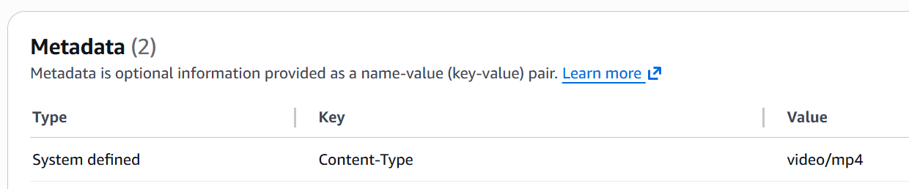
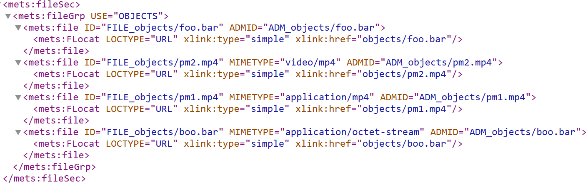

# Determination of Content Type

> [!IMPORTANT]
> The following assumes we are running on Amazon S3 for Deposit Storage and not a local file system.

If you upload a file in the UI, we try to determine the content type in your browser, as soon as the file is selected on the local file system. We read the value of the file input element's files property and read the `type` in JavaScript:

```javascript
    fileContentType.value = fileSelector.files[0].type;
```

(see https://developer.mozilla.org/en-US/docs/Web/HTML/Reference/Elements/input/file#type)

The value of type is included in the submitted form, which is handled by `OnPostUploadFile` in Deposit.cshtml.cs.

If no value is supplied in the form submission, we use the [MimeTypes](https://github.com/khellang/MimeTypes) library to determine it:

```c#
    if(string.IsNullOrWhiteSpace(depositFileContentType) && MimeTypes.TryGetMimeType(slug, out var foundMimeType))
        depositFileContentType = foundMimeType;
```

We then call `WorkspaceManager.UploadSingleSmallFile(...)`, supplying the detemined content type (which might still be null).

This will cause `UploadFileToDepositHandler` to run, which makes an S3 `PutObjectRequest`:

```c#
var req = new PutObjectRequest
{
    BucketName = s3Uri.Bucket,
    Key = fullKey,
    ContentType = request.ContentType,
    ChecksumAlgorithm = ChecksumAlgorithm.SHA256,
    InputStream = request.Stream
};
```

The content type can still be null or empty at this stage. If so, the file on S3 will be given the content type `application/octet-stream` in its object metadata, and we will retrieve this and apply it to the object. (NEW)

> [Here we re-acquire the object metadata](https://github.com/digirati-co-uk/digital-preservation/blob/46486d20d067484632ab5fdecda2ff8feb8b3c2a/src/DigitalPreservation/DigitalPreservation.Workspace/Requests/UploadFileToDeposit.cs#L75).

If the supplied content type was empty, we use the S3 content type.
And if the S3 content type is empty (unlikely), we use the value `ContentTypes.NotIdentified` (which is "dlip/not-identified"). (NEW)

(we don't want to store this special type in METS though - see later)

S3 only sets the content type metadata if we don't supply one in the form upload - it will return the ContentType we supplied in the original PutObjectRequest unless it was empty.

Either way this gets stored in the S3 object metadata:



If we put the object directly in S3 and then regenerate the filesystem, then obviously S3 sets this metadata field, unless we set it ourselves manually.

So for an _uploaded_ file, the object on S3 has metadata that is either from:

 - the uploaded form field (browser-detected)
 - MimeTypes if none sent by the browser
 - S3's own determination, if none returned from MimeTypes

... and a directly placed file will return either

 - what we explicitly set on our manual direct upload
 - S3's own determination, if we didn't specify a Content Type

We then create a WorkingFile and add this to the __metslike.json local file model, viewable on /deposits/{id}/depositfilesystem in the UI application. This will later be `CombinedFile.FileInDeposit` when we start comparing for mismatches.

By this stage it is _extremely unlikely_ that the WorkingFile has `ContentTypes.NotIdentified` because S3 always *_seems_* to apply something - it won't let the object be served without a content type.

We then ADD the WorkingFile to METS, and the ContentType appears as the MIMETYPE attribute of the mets:file element:



 - The first file here has no MIMETYPE element because it was either empty or was `ContentTypes.NotIdentified` (now assumed to be extremely rare).
 - The second file was determined on the browser as video/mp4 and this makes its way all the way through to the METS.
 - The third file demonstrates that we can supply an alternative ContentType value on the PutObjectRequest to S3 and it will persist into METS.
 - The fourth file is something which neither the browser or MimeTypes could determine a content type for, and S3 applied application/octet-stream, which persists into METS.

# Further information from tools

If we now run Siegfried over these files, we acquire


In S3, 

| Source | Where |
|-----------|-------|
| input file element | in-browser |
| MimeTypes | On file upload if not in form submission |
| S3 determined | in GetObjectMetadataResponse => .Headers.ContentType |