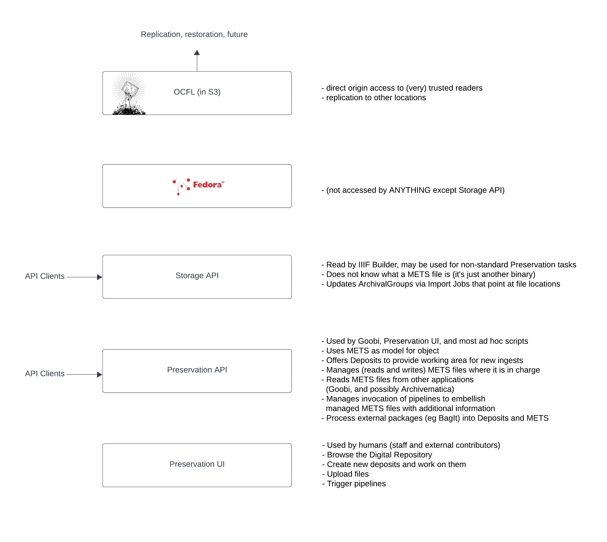
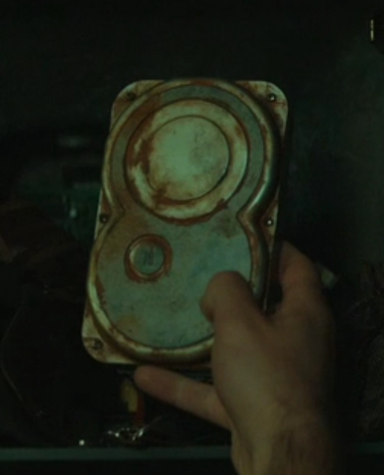

# Introduction

This documentation is about how to _use_ the Leeds Digital Preservation Stack. It is aimed at developers using the Preservation API, and also the Storage API.

It is also aimed at users of the Preservation user interface.

## The Preservation Stack

<!--
    OCFL (in S3)     - direct origin access to (very) trusted readers
                       replication to other locations

    Fedora           - (not accessed by ANYTHING except Storage API)

    Storage API      - Read by IIIF Builder, may be used for non-standard Preservation tasks
                       Does not know what a METS file is (it's just another binary)
                       Updates ArchivalGroups via Import Jobs that point at file locations

    Preservation API - Used by Goobi, Preservation UI, and most ad hoc scripts
                     - Uses METS as model for object
                     - Offers Deposits to provide working area for new ingests
                     - Manages (reads and writes) METS files where it is in charge
                     - Reads METS files from other applications (Goobi, and possibly Archivematica)
                     - Manages invocation of pipelines to embellish managed METS files with additional information
                     - Process external packages (eg BagIt) into Deposits and METS

    Preservation UI  - Used by humans (staff and external contributors)
                     - Browse the Digital Repository
                     - Create new deposits and work on them
                     - Upload files
                     - Trigger pipelines

-->

## OCFL

The [Oxford Common File Layout](https://ocfl.io/1.1/spec/) (OCFL) is what ends up preserved "on disk" - or in our case, in AWS S3. OCFL is the **goal** of the rest of the digital preservation stack. Versioned archival objects, in a file layout that conforms to an agreed specification.

The idea is that we can recover everything that was preserved just from a backup of the OCFL file system (or S3). For example, we find a hard drive with an OCFL file layout and a copy of the OCFL specification.

We don't need running systems just for there to be preserved content.

The individual units of Preservation - the things we consider to have boundaries that sensibly define versions - correspond to [OCFL objects](https://ocfl.io/1.1/spec/#object-spec). An object might have one file or might have hundreds. It might correspond to a digitised archival _Item_, a digitised book, or a born digital _Item_. 

The OCFL contents can be replicated to other locations for backup.

## Fedora

**Fedora is a Gateway to OCFL**

We could write the OCFL directly to disk or S3, managing it ourselves. But we don't do that, because [Fedora 6](https://wiki.lyrasis.org/display/FEDORA6x) does this for us. OCFL is how Fedora 6 persists the repository to disk, and how it manages versions.

Fedora 6 offers many modelling and management features; its implementation of the _Linked Data Platform_ and ability to store arbitrary triples allows it to be used to model complex objects within the repository.

_We choose not to make use of these features_. We are using Fedora as the means of writing OCFL. 

For this reason, we only use a subset of Fedora's capabilities.

 - Basic Containers (which we everywhere just call Containers)
 - Binaries
 - Archival Groups (which correspond to versioned OCFL Objects)
 - Transactions

## Storage API

All communication with Fedora is via the Storage API. Nothing else can talk to Fedora!

Direct use of the Storage API is rare, as most use cases are better served by the Preservation API, which offers a richer model and workflow for Digital Preservation tasks. You might develop an application against the Storage API if all you are doing is reading preserved content. The Storage API allows navigation of the repository structure as a hierarchy of Containers, containing Archival Groups (preserved objects) which in turn contain further Containers and Binaries (the preserved files). When the API returns Binaries, their `origin` property gives direct access to the underlying location of the file in AWS S3.

Creating an updating Archival Groups is done by sending the Storage API an **Import Job** - a JSON document that describes Containers and Binaries (folders and files) somewhere on disk or S3 _outside of Fedora_ that the Storage API should ingest _into Fedora_. The Storage API manages the Fedora transaction for this work and controls the process of getting the content (no matter how many files) into Fedora. The Storage API validates the import job and then performs it asynchronously. Callers can observe the process of an Import Job by requesting an Import Job Result - which could take minutes or hours to complete.

The Storage API can store anything you can describe in an Import Job, as long as it has access to the origin locations of the binaries. It needs the import job to provide:

- URIs of source and destination, where the source might be an S3 URI and the destination is the Storage API URI of the binary
- SHA256 hash (digest) of each binary - the Storage API expects Fedora to agree with the supplied digest.
- Name (records non-URI-safe original file and directory names, e.g., "my notes.doc")
- Content Type of binaries (e.g., `application/pdf`)

It offers no modelling capabilities other than the file system layout. The Storage API has no concept of the files it is storing and can store anything in an Archival Group.

## Preservation API

Whereas the Storage API can be thought of as _Fedora-facing_ - hiding the specific of Fedora behind an interface that's only concerned with Archival Groups, Containers, Binaries and Import Jobs - the Preservation API is _application-facing_ - it provides the mechanisms to build workflows for human- and machine- driven preservation activities.

The Preservation API understands METS files, and will create a METS file for an Archival Group. It expects that the Archival Groups it deals with have a METS file in their root that describes or models the digital object. It also understands METS files created by other systems (for example, a METS file in an Archival Group created by Goobi).

The Preservation API introduces the concept of a **Deposit**, which provides the location "somewhere on disk or S3 _outside of Fedora_" required by the Storage API. A Deposit is like a workspace for assembling, modifying or exporting an Archival Group.

Typically, a user (whether human via the UI, or machine via the API) will:

 - create a Deposit, which gives the user a working area they can put files in. By default, for a new Deposit, a mets.xml file will be created in the root alongside an /objects folder ready to put content in.
 - create directories within the deposit, and upload or copy files into those directories
 - supply additional administrative metadata at the root, directory or file level to specify access conditions and rights statements.
 - generate an import job from the deposit files (a diff operation between the Deposit content and the Archival Group, which will be _all_ diff if the Archival Group does not yet exist).

A user can generate an import job themselves for fine control of the operation.
They can then execute the import job (the Preservation API mutates it and sends it to the Storage API).

A user can also create a new Deposit by exporting an existing Archival Group. This is how content is retrieved from the Preservation API - it puts the content on disk.

The Preservation API knows about METS files and Deposits; the Storage API knows only about files - sources and destinations.

## Preservation UI

The Preservation UI provides a user interface over the Preservation API, as well as working on the Deposit directly. For example, uploading a new file into the Deposit and editing the METS file can be done directly by the Preservation UI, the Preservation API doesn't know about it. 

Another common scenario for the Preservation UI would be to create a Deposit, specify an Archival Group target for the Deposit, and then independently upload a very large BagIt bag of files that has been worked on in BitCurator into the Deposit working area. Later the user would come back to the Preservation UI and get it to process the files.

## IIIF Builder

Understands the extra things that Leeds users are putting in the METS files

## IIIF Cloud Services

Hosts and manages the IIIF Resources built by IIIF Builder, and the Content Resources generated from source binaries in digital preservation (most commonly, IIIF Image API services from archival TIFFs).