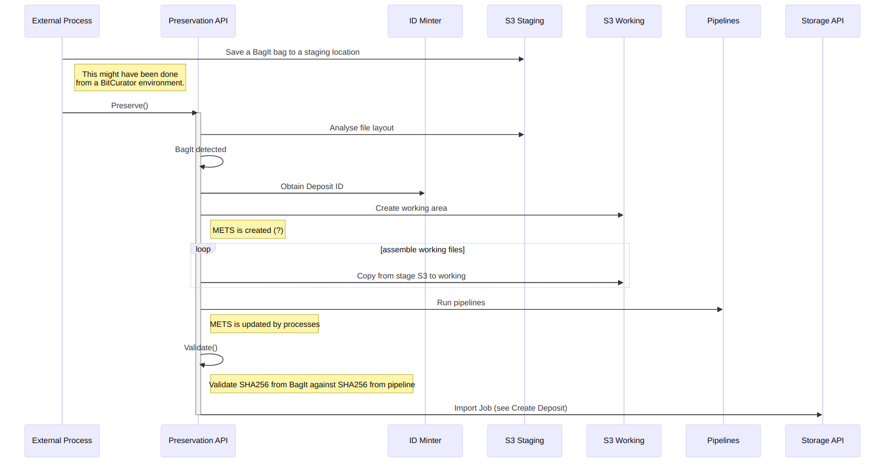

# Create deposit from external file set

Show that we provide a separate API to PUT files to S3 (eg Goobi can do this)

> I can ask that the Preservation Service fetches the files from a provided location. S3 bucket initially, ambient access; we don’t mind how the files got there and they might just be raw files or they might be a BagIt layout (we try to detect this). Can add more sources as needed.

## External process PUT-ting files

Is this what Goobi is doing?

NB the details of interaction with storage are omitted, see [Create Deposit](create-deposit-with-notes.md)

### Notes

Here the External API is just making PUTs, but it could use the Preservation API to work on the files. It MUST supply a checksum.

## Fetch a BagIt Bag

In the above flow the external process was driving the deposit - creating a new deposit, PUTting binaries one at a time, then completing the process.

In the following flow, the external process just tells the Preservation API (not the Storage API) that there is a set of files waiting _somewhere_ - typically S3 - and that it should create and preserve a deposit from them. The Preservation API detects that the external location contains a BagIt bag, with checksums etc. It doesn't just reproduce the BagIt inside Fedora, it turns the BagIt into a digital object.

We could create METS just from the BagIt, but we run the standard pipelines anyway. This verifies that checksums in the BagIt metadata are still correct. The BagIt bag is just a different way of supplying the checksums.

