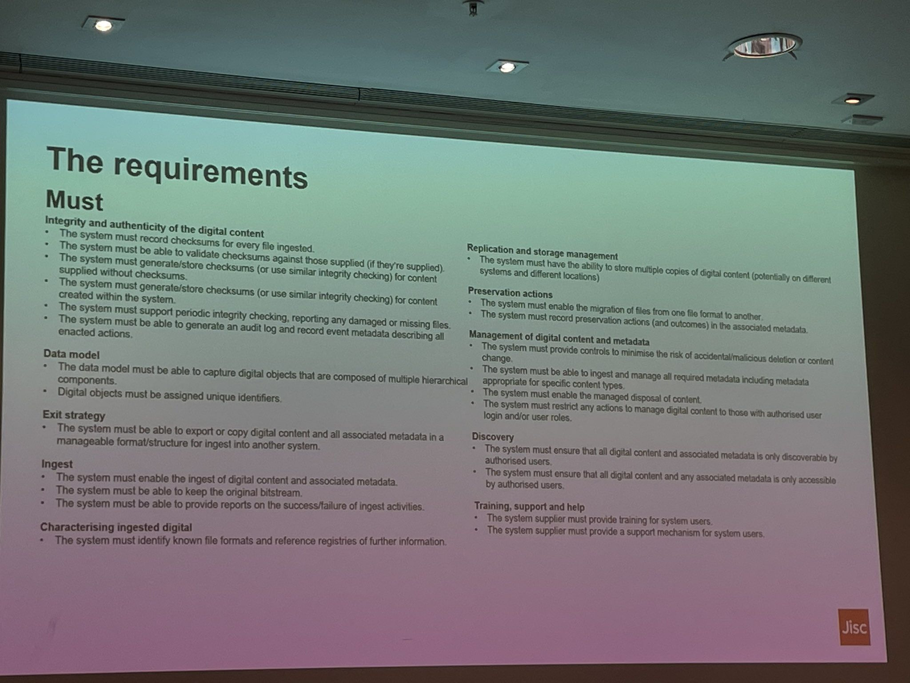

# Determine best practices for *what* we store in Fedora

(This RFC is Reference M01 in Statement of Work 3)

## Context

This document will frame itself around the "core requirements identified by UK universities for digital preservation systems providers" mentioned in this slide:

Source: https://twitter.com/wisealic/status/1760281050490552398

For context, what is the "digital preservation system"? Is that Fedora?

Fedora is the **storage** part of Digital Preservation.

A Digital Preservation System also includes the APIs, user interfaces and workflows implemented in software that _result in_ content being preserved in storage. These are other software artifacts and processing behaviour that encapsulate policy.

A Digital Preservation System is also an agreed approach to describing the content being stored, so that it can be understood later. These descriptions are not semantic (that's the catalogue's job), they are technical and structural. There needs to be a *model* (or multiple models) to describe what is preserved, and attach technical and structural information to.

What is NOT part of Digital Preservation?

- The asset delivery - IIIF image services derived from preserved content, transcoded AV
- The IIIF Presentation layer
- The Catalogue API 
- Public facing web sites

The Digital Preservation System is much bigger than Fedora - but it is not the whole of the DLIP project.

## Choice of Fedora

From the Fedora 6 documentation:

> Fedora is a standards-based, open source repository designed for the robust preservation of digital content.  It provides a REST interface based on web standards including the  Linked-Data Platform (LDP),  Web Access Control (Solid/WebAC),  Memento, and Activity Streams 2.0 specifications.   Persistent content is stored on disk using the  Oxford Common Filesystem Layout (OCFL), the gold-standard of application-independent, transparent, and robust file storage. 

We choose Fedora because of its OCFL support. It is the Oxford Common File Layout we are interested in: the result we are seeking.

The other aspects of Fedora - its "REST interface based on web standards including the  Linked-Data Platform (LDP),  Web Access Control (Solid/WebAC),  Memento, and Activity Streams 2.0 specifications" - are _means to an end_ with the end being the preservation of digital objects in an OCFL arrangement.

For DLIP we will use these means to store content; but we entertain the possibility that in future there will be other ways of getting content into preservation storage as OCFL other than via Fedora's APIs.

Given this constraint, we need clear guidelines on _how_ we use Fedora; what of its features should we take advantage of, and what should we avoid doing? We introduce a dependency on Fedora by relying on its APIs to get content into preservation storage, but how enduring is that dependency? 

We constrain our use of Fedora to comply with our aims by building a **_Storage API_** and insisting that no parts of the DLIP other than this API have access to Fedora's own APIs. Every interaction with Fedora must go through our Storage API layer.

## Constraints provided by a Storage API

We limit our use of Fedora resource concepts to just three classes:

### 📁 Basic Container

For representing structure: directories, for organising the repository itself, and for representing directories within an archival group.

### 📦 Archival Group

For representing digital objects – e.g., the files that comprise a digitised book, or a manuscript, or a born digital item. An Archival Group might only have one file, or may contain hundreds of files and directories (e.g., digitised images and METS.xml)

### 📄 Binary

For representing a file, any kind of file.

...and using these classes, the API enforces these rules:

* The Storage API will prevent creating a 📁 Basic Container within an 📦 Archival Group outside of versioning the Archival Group as a whole.
* The Storage API will prevent creating an 📦 Archival Group within an 📦 Archival Group (even though Fedora allows this)
* The Storage API will not allow direct creation of a 📄 Binary at all, they must come in as versioned updates of the whole Archival Group / OCFL object.
* The Storage API assumes that the file and folder names have been normalised to a reduced character set, still to be defined, that is guaranteed safe for S3 as well as any common filesystem or HTTP request path. 
* This means that original file names, e.g., my document.doc (which contains a space), need to be recorded some other way. 
* It is the responsibility of client applications like Goobi, or the deposit service, or a custom EPrints migrator, to ensure that they have already normalised filenames, and take steps to record the original file name.

## Modeling

Fedora provides rich [ability to model content](https://wiki.lyrasis.org/display/FEDORA6x/Data+Modeling). We could adopt techniques like the [Portland Common Data Model](https://wiki.lyrasis.org/display/FEDORA6x/LDP-PCDM-F4+In+Action) or [invent our own models](https://wiki.lyrasis.org/display/FEDORA6x/Example+Content+Model) to suit the content.

**We shouldn't use Fedora like this**

We should be bound by the constraints above, and _carry the model as part of the preserved object_ - for example, by describing the object with a METS file.

METS is a well-established standard designed specifically for this purpose, it is safe to use it to encode and convey technical and structural metadata about digital objects, and store it alongside the content, in the preservation system, as part of the preserved object. A structural convention ensures the METS file itself is never mistaken for being part of the preserved intellectual object.

How an object is modelled becomes a policy decision - which can be strictly enforced, e.g., by Goobi in software as it creates a METS file - but is independent of the **storage** layer.

Different types of content can have different approaches to modelling, suited to their needs. 

## So, what is stored in Fedora?

Cambridge store anti-virus reports per-file and PRONOM file format information in Fedora, alongside the binary object, as additional data for each file. This means that their digital preservation has no knowledge of METS (although it may be preserving METS files as part of digital objects)

An alternative would be to use METS files to carry this information – either a METS file generated by a pipeline during preservation, or by adding to an existing METS file generated at a previous step. It is standard practice to store this in a METS TechMD section (Goobi and Archivematica both do this).

This doesn’t make the storage service itself dependent on METS – you can any object in it, with or without a METS file – but if you ask it to run our pipeline and store PRONOM and virus scan outputs, it will store it in a METS file rather than as Fedora triples.

This latter approach is in line with the idea that the preservation service itself has no special understanding of what’s in it; external applications bring meaning to it, often (but not exclusively) by using METS to describe structure, administrative and technical metadata, access conditions, rights and so on as simply or as complex as they need.

While no additional information **at all** is _required_ to be stored in Fedora, but that it’s probably useful to use two existing Fedora properties that are fairly fundamental – `Name` (dc:title) to record the original file or folder name, and `content-type` to record the content type (e.g., image/tiff, application/msword). Fedora has specific API support for these, rather than being arbitrary data.

This means a preserved digital object is free to use METS – or some other mechanism – to carry whatever information it needs, including content type and original file name, but our storage API will attempt to write these two pieces of information to Fedora.

## Assessing this approach against the Core Requirements

### Integrity and authenticity of the digital content

#### The system must record checksums for every file ingested
#### The system must be able to validate checksums against those supplied (if they're supplied)

This two requirements are met by Fedora itself; it can store multiple checksums and checking supplied _digest_ headers is part of a content transaction. We mediate this by the Storage API.

#### The system must generate/store checksums (or use similar integrity checking) for content supplied without checksums
#### The system must generate/store checksums (or use similar integrity checking) for content created within the system

The Preservation aspect of DLIP must ensure that content cannot arrive at Fedora without a checksum that Fedora can verify once the file is "at rest" - safely preserved.

That means that _something_ has to generate a checksum higher up the chain. But this will vary depending on the content. For content introduced as files uploaded to a web user interface, that checksum should happen on the client (in the browser), be verified at the server, and travel with the content until it is safely stored. For other workflows the point at which a checksum is generated will vary.  While the storage API should always require a checksum, different pipelines into that storage can generate checksums at appropriate points.

#### The system must support periodic integrity checking, reporting any damaged or missing files

Fedora supports [fixity checking](https://wiki.lyrasis.org/display/FEDORA6x/RESTful+HTTP+API+-+Fixity) - but the orchestration of periodic large-scale checking of the preserved content would need to be organised higher up, as some other process within DLIP.

#### The system must be able to generate an audit log and record event metadata describing all enabled actions

Some actions will be calls to the Fedora API, and some will be in consuming APIs or pipelines. We can consolidate these into a single _stream_ of preservation activity. One decision to be made is whether the identity within Fedora is mapped to users/actors in other systems - i.e., do we create a Fedora user for every person and system that will be involved in systems higher up, and map their identities so that the distinct identity is preserver within Fedora, or do Fedora actions all get performed in the Fedora context by a single Fedora user?

### Data model

#### The data model must be able to capture digital objects that are composed of multiple hierarchical components

This is where we explicitly say that we don't do this _formally_ at the Fedora level, even though it allows it. Ultimately the preserved content is a set of OCFL objects within a containment structure (folders), and we won't allow one OCFL object inside another because we won't allow an Archival Group to exist within another Archival Group.

Modelling decisions external to Fedora determine what an Archival Group _means_. And one influence on that is what it would mean to _version_ an object.

Examples:

* A book may have internal structure - chapters - but still be considered a single Archival Object. The structural model is captured in METS structMap elements (and will later be directly reflected in IIIF Ranges).
* A Periodical may comprise hundreds of _issues_ within dozens of _volumes_. You could choose to model each issue as a separate object, or each volume, or even (unlikely) the whole publication history of the periodical. All could in theory be expressed as a model in (large) METS files. Modelling should be guided by making manageable sized digital objects on the one hand, and future recoverability as a sensible intellectual object on the other. What would it mean to version an issue of a periodical (e.g., to insert a missing scanned image)?
* An archival hierarchy _probably_ translates to distinct versioned preserved digital objects at the **item** level - but not necessarily.

In short - the Preservation aspect of DLIP must allow us to model and preserve "digital objects that are composed of multiple hierarchical components" but it is not _necessarily_ within Fedora that the relationship between parts is captured.

#### Digital objects must be assigned unique identifiers

Everything in Fedora must have a unique URI, but the source of path elements in the URI will in DLIP be external to Fedora - on no account should we ever leave Fedora to assign a GUID because we have failed to specify our own identifier. 

The source of identity is the identity service (see ...)

### Exit strategy

#### The system must be able to export or copy digital content and all associated metadata in a manageable format/structure for ingest into another system

This format/structure is OCFL _plus_ whatever additional files are capturing model within an object (typically METS). We don't even need Fedora to export, we can just take the OCFL object from the underlying storage, with all its version history plain to see.

**In fact this is a design principle - we must be able to do this independently of Fedora**

This exit strategy is also far-future access to the content in the absence of the technology it today depends on. An OCFL repository should include a copy of the OCFL specification at the root; we should likewise include copies of other relevant specification that are required to interpret the content (for example the METS specification).

### Ingest

#### The system must enable the ingest of digital content and associated metadata
#### The system must be able to keep the original bitstream
#### The system must be able to provide reports on the success/failure of ingest activities

These three are all core aspects of Fedora itself, and we will expose them to dashboard/admin applications via the Storage API

### Characterising ingested digital (?)

#### The system must identify known file formats and reference registries of further information

This won't happen in Fedora. It will be the responsibility of pipelines higher up to run tools that identify what PRONOM file type a file has; this PRONOM identifier references the PRONOM registry. The PRONOM identifier will usually be stored in Fedora within a METS file for the digital object. We will also store the content type (aka media type aka mime type), where known, as a field in Fedora itself _as well as in the METS file_.

The significance of the content type is often downplayed and while the PRONOM identification is crucial, the fact that the content will be provided over the web means we should where possible record our best understanding of the content type as well.

### Replication and storage management

#### The system must have the ability to store multiple copies of digital content (potentially on different systems and different locations)

OCFL makes this easier for us; it is sufficient to copy the OCFL object to another file system or blob storage anywhere in the world. This is orchestrated outside of Fedora and a Fedora instance has no knowledge of other locations for the content it holds.

We can probably adopt the same approach as Cambridge and use AWS-level inventory and replication mechanisms.

The file name normalisation constraint mentioned above should be strict enough that all paths will be valid in any conventional file system, S3 or Azure-style blob storage.

### Preservation actions

#### The system must enable the migration of files from one format to another

This should NOT be the concern of Fedora, and may not even be the concern of the Preservation System at all.

All Fedora does is preserve the original and not complicate it with different formats and derivatives.

There are two aspects to this question and they relate to the purpose of file format migration.

##### Access to the content

In DLIP, the IIIF Cloud Services has the job of transforming files into web-suitable formats. Most obviously, an archival tiff might be provided as a IIIF Image Service. But also, a high resolution video master may be made accessible as a web-friendly MP4. And an obsolete WordPerfect document may be made available as a PDF. But these are asset **delivery** concerns rather than preservation concerns.

##### Safety of the intellectual content in the face of obsolete software 

The preservation concern is "what if we lose the means to transform tha WordPerfect document to a PDF?" While _transformation_ of content may lie outside the preservation storage, we might still want the ability to put transformed versions of originals back into preservation storage (e.g., so that the more accessible PDF version is also safe and not dependent on runtime infrastructure).

We can still do this through policy. For example, update a preserved object with a new folder of derivatives next to the original container structure. The originals must always be preserved and not intermingled with derivatives, but we might choose to occasionally enlarge the preserved object with a shadow subset of transformed files in parallel. And it could be the IIIF Cloud Services that makes these derivatives.

A related question is derivatives like OCR or human-generated transcription - these might only be generated after the object is preserved, but still be worth preserving - putting back into the object, enriching the object.

#### The system must record preservation actions (and outcomes) in the associated metadata

This parallel structure of derivatives needs to be transparently comprehensible to anyone making sense of the preserved content in the future.

### Management of digital content and metadata

The following will all require a user management layer on the Storage API that's running above Fedora. This will use OAuth2 to protect API operations, with different roles with different permissions.

The issuing of API tokens to applications with roles, or applications acting on behalf of users with roles, still needs to be designed; we assume that the source of user identity is the University's [...]

#### The system must provide controls to minimise the risk of accidental/malicious deletion or content change

It's actually quite hard to completely remove content from Fedora, and previous OCFL versions will be preserved. But sometimes you have to remove things completely.

#### The system must be able to ingest and manage all required metadata including metadata appropriate for specific content types

#### The system must enable the managed disposal of content

#### The system must restrict any actions to manage digital content to those with authorised user login and/or user roles

### Discovery

#### The system must ensure that all digital content and associated metadata is only discoverable by authorised users

#### The system must ensure that all digital content and any associated metadata is only accessible by authorised users

### Training, support and help

#### The system supplier must provide training for system users

#### The system supplier must provide a support mechanism for system users

