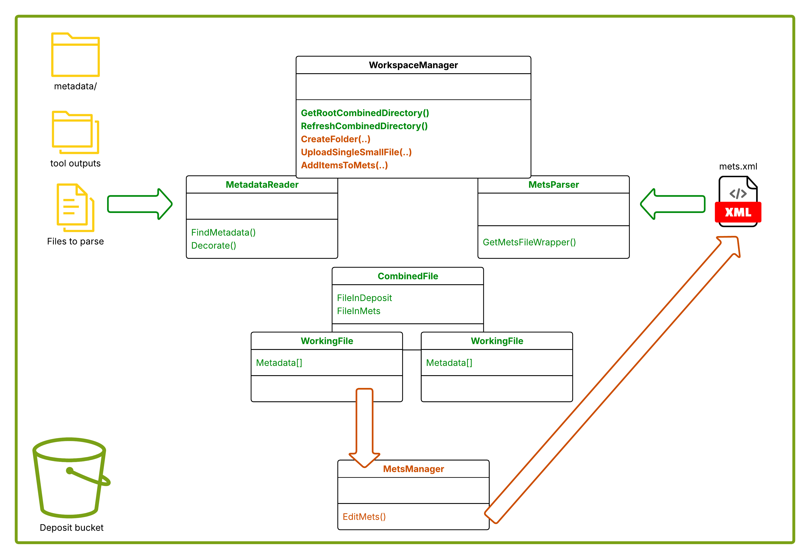
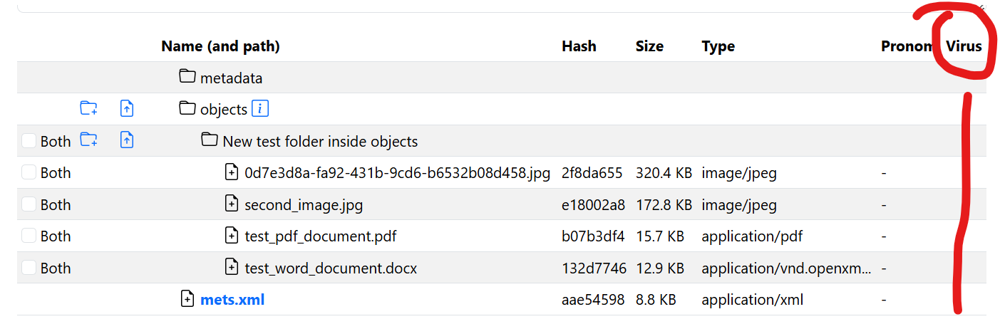
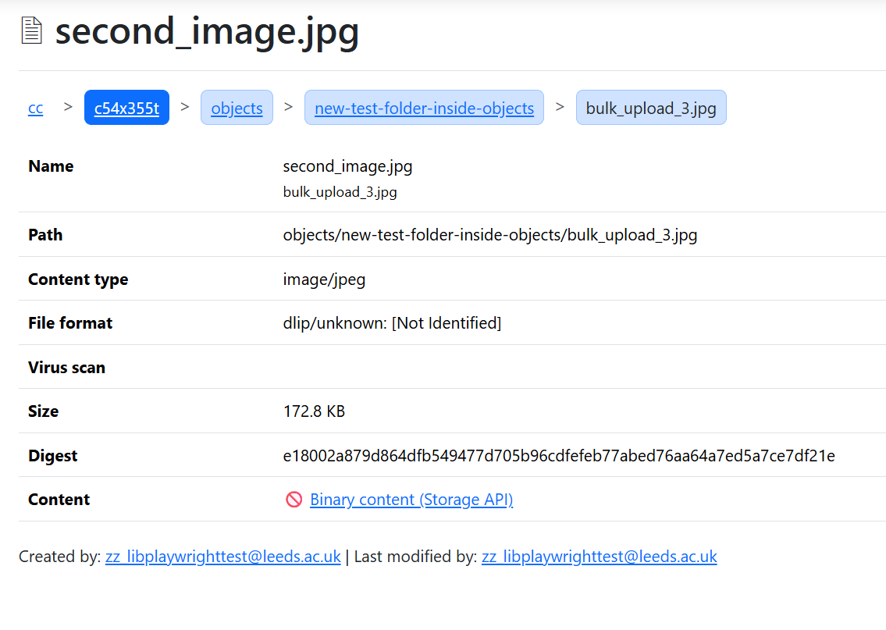

# Virus scanning and dealing with outputs

We will use ClamAV to scan deposit files for viruses as part of the pipeline.

We can either run it on its own, or via Brunnhilde. Seeing as we are already doing the latter this may be the simplest way.

The Freshclam tool should be run at least at the start of each day to update the virus definition files:

https://docs.clamav.net/manual/Usage/SignatureManagement.html

ClamAV will still run without this but will emit warnings when its definition files are more than 7 days old.

## Performance considerations

We need to see how well ClamAV works on files via the S3 Mountpoint filesystem. Whereas file format identification (Siegfried) usually just needs to read the file header, ClamAV will have to read the entire file. The local disk space that the S3 Mountpoint uses under the hood needs to accommodate this.

## Outputs

From what we have seen so far, Brunnhilde emits a file: /metadata/brunnhilde/logs/viruscheck-log.txt.

For a clean deposit, this file looks like this:

```
----------- SCAN SUMMARY -----------
Known viruses: 8707831
Engine version: 1.0.9
Scanned directories: 1
Scanned files: 1
Infected files: 0
Data scanned: 0.42 MB
Data read: 0.39 MB (ratio 1.06:1)
Time: 29.859 sec (0 m 29 s)
Start Date: 2025:09:12 09:21:57
End Date:   2025:09:12 09:22:26
Date scanned: 2025-09-12 09:21:57.081789
```

And for a found virus, the output looks like this:

```
/home/brian/Test/data/objects/virus_test_file.txt: Eicar-Signature FOUND
----------- SCAN SUMMARY -----------
Known viruses: 8707575
Engine version: 1.4.3
Scanned directories: 1
Scanned files: 2
Infected files: 1
Data scanned: 0.00 MB
Data read: 0.00 MB (ratio 0.00:1)
Time: 22.347 sec (0 m 22 s)
Start Date: 2025:09:19 10:20:10
End Date:   2025:09:19 10:20:32SS
Date scanned: 2025-09-19 10:20:10.499694
```


## Reading the virus report

WorkspaceManager (whether used by the Preservation API, Preservation UI or any other .NET application) works on a representation of the Deposit filesystem on disk/S3, in the METS, and the union of the two. We read the Deposit files and generate a tree of `WorkingDirectory` and `WorkingFile` classes, and we read the METS and generate another tree of `WorkingDirectory` and `WorkingFile` classes, and then we make a *union* of these two trees as a tree of `CombinedDirectory` and `CombinedFile`. In very simplified form:

```c#
/// The real classes are much more complex than this!

public class CombinedDirectory
{    
    public WorkingDirectory? DirectoryInDeposit;
    public WorkingDirectory? DirectoryInMets;
    
    public List<CombinedFile> Files;
    public List<CombinedDirectory> Directories;
}

public class CombinedFile
{    
    public WorkingFile? FileInDeposit;
    public WorkingFile? FileInMets;
}
```

Information from the tool outputs under /metadata is used to **decorate** the [metadata](https://github.com/uol-dlip/digital-preservation/blob/e9946dc13f2cf3e58d7237787d0b9c2cfabffe93/src/DigitalPreservation/DigitalPreservation.Common.Model/Transit/WorkingBase.cs#L36) property of `WorkingDirectory` and `WorkingFile` classes representing the filesystem:

```c#
// The base class of WorkingDirectory and WorkingFile
public abstract class WorkingBase
{
    ///....
    
    public List<Metadata> Metadata { get; set; } = [];
}
```

The class that does the work here is [MetadataReader](https://github.com/uol-dlip/digital-preservation/blob/2a4cecd3e741ba7466a36ba129f335473df69509/src/DigitalPreservation/DigitalPreservation.Workspace/MetadataReader.cs).

And similarly, information from the METS is used to **decorate** the [metadata](https://github.com/uol-dlip/digital-preservation/blob/e9946dc13f2cf3e58d7237787d0b9c2cfabffe93/src/DigitalPreservation/DigitalPreservation.Common.Model/Transit/WorkingBase.cs#L36) property of `WorkingDirectory` and `WorkingFile` classes representing the METS structure.

The class that does the work here is [MetsParser](https://github.com/uol-dlip/digital-preservation/blob/cb21241db9f3f36b310d9e31808dc960c6b9b68c/src/DigitalPreservation/Storage.Repository.Common/Mets/MetsParser.cs).

In WorkspaceManager we end up with a tree of CombinedDirectory/CombinedFile that will have one or other or both of DirectoryInDeposit/FileInDeposit and DirectoryInMets/FileInMets populated (and never neither - it's the union of the two trees, there can't be any node that isn't populated from either side).

> [!NOTE]  
>  - MetadataReader decorates FileInDeposit from the tool output in the Deposit under `metadata/`
>  - MetsParser decorates FileInMets from the structMap, amdSec and other relevant elements in the METS file.
>  - We need to write information we learn from the Deposit metadata into the METS file.

### Reading viruscheck-log.txt

> We need to write information we learn from the Deposit metadata into the METS file.

We already do this for the Siegfried output (via Brunnhilde).

The first new task is to add the per-file information from the viruslog file to each WorkingFile as an `IMetadata` instance.

There is already [some stub code](https://github.com/uol-dlip/digital-preservation/blob/2a4cecd3e741ba7466a36ba129f335473df69509/src/DigitalPreservation/DigitalPreservation.Workspace/MetadataReader.cs#L70-L74) for this:

```c#

private List<string> infectedFiles = [];


private async Task FindMetadata()
{

    // ..... lots of other code omitted - but the following code already exists as a stub
    
    var brunnhildeAVResult = await storage.GetStream(brunnhildeRoot.AppendEscapedSlug("logs").AppendEscapedSlug("viruscheck-log.txt"));
    if (brunnhildeAVResult is { Success: true, Value: not null })
    {
        infectedFiles = await ReadInfectedFilePaths(brunnhildeAVResult.Value);
    }

    // ..... lots of other code omitted

}

private async Task<List<string>> ReadInfectedFilePaths(Stream stream)
{
    var txt = await GetTextFromStream(stream);
    // TODO - actually parse this once we have an infected example
    return [];
}
```

> [!CAUTION]
> This needs to be replaced - I think `infectedFiles` isn't just a list of string file paths but instead a list of objects that can carry that "Eicar-Signature FOUND" message as well as the path.

Then, we will have a method `AddVirusScanMetadata` that does for this virus data what [AddFileFormatMetadata](https://github.com/uol-dlip/digital-preservation/blob/2a4cecd3e741ba7466a36ba129f335473df69509/src/DigitalPreservation/DigitalPreservation.Workspace/MetadataReader.cs#L147) does for the Siegfried output:

```c#

    private void AddFileFormatMetadata(SiegfriedOutput siegfriedOutput, string commonParent, string source, DateTime timestamp)
    {

        // have a look at the existing code!

    }

    private void AddVirusScanMetadata(List<???> infectedFiles, string commonParent, string source, DateTime timestamp)
    {
        // this is the new method

        foreach (var file in infectedFiles)
        {
            var localPath = file.Filename.RemoveStart(commonParent).RemoveStart("/"); // check this!
            var metadataList = GetMetadataList(localPath!);
            metadataList.Add(new VirusScanMetadata
            {
                Source = source,
                ??? = ???,
                ??? = ???
            });
        }
    }

```

We already have a [placeholder class](https://github.com/uol-dlip/digital-preservation/blob/721e322262bc0c3326aa2efdb97bfac796304737/src/DigitalPreservation/DigitalPreservation.Common.Model/Transit/Extensions/Metadata/VirusScanMetadata.cs) for Virus metadata:

```c#
public class VirusScanMetadata : Metadata
```

This class isn't doing much at the moment but is used in the UI. The actual fields of this class are ultimately dependent on:

 - what info is available
 - what we want to surface in the UI
 - what we want to write to the METS.


## Writing virus information to METS

Refer to the [example METS file](120-files/mets_am.xml). This is a Wellcome METS file generated by Archivematica. ClamAV is run as part of the pipeline.

It is extremely verbose, and we don't need all this information. (This METS file only has one actual file under /objects). But we can follow the general pattern.

You can see here the PREMIS metadata for the file AfH-25-04-06_Presentation_at_the__Embassy_of_Japan.ppt, under this path:

```
mets:mets/mets:amdSec[ID=amdSec1]/mets:techMD[ID=techMD_1]/mets:mdWrap/mets:xmlData/premis:object
```


We do the same in the METS we generate, here's a DLIP-produced METS for a file in objects:

```
mets:mets/mets:amdSec[ID=ADM_objects/pxl_20250825_142937791_v17.png]/mets:techMD[ID=TECH_objects/pxl_20250825_142937791_v17.png]/mets:mdWrap/mets:xmlData/premis:object
```


Until now we haven't produced any additional sections, but it makes sense to represent the virus data in our METS the same way Archivematica does (because we can already parse Archivematica METS).

> [!IMPORTANT]
> We use a very "loose" (i.e., forgiving, flexible) parser to read METS, to accommodate different flavours of METS from different software. This is `MetsParser`. When we **write** METS - which we only do for our own METS files (we never edit an externally-produced METS) we use a much more rigid mechanism, a class library generated from the METS Schema. This class library is the [DigitalPreservation.XmlGen](https://github.com/uol-dlip/digital-preservation/tree/main/src/DigitalPreservation/DigitalPreservation.XmlGen) project in the .NET solution. The **exact** tools and commands used to produce the classes are in the [_tools](https://github.com/uol-dlip/digital-preservation/tree/main/_tools) folder.


> [!CAUTION]
> Never manipulate the METS XML directly _*when writing METS*_.

The next task in the RFC is to describe the end result - what we want in the METS file.

Then we can join the two together in the middle.

 1. We need to read tool outputs in the Deposit under /metadata and turn them into a `VirusScanMetadata` class for each file.
 2. We need to read virus scan records in the METS file and turn them into a `VirusScanMetadata` class for each file.
 3. We also need to turn `VirusScanMetadata` instances into virus scan records in the METS file when we create or update DLIP METS.





### Comparison with Wellcome (temporary section)

> [!TIP]
> This section explores what Wellcome have in their Archivematica-produced METS.

[mets_am.xml](120-files/mets_am.xml)

This METS file has only one actual piece of content under objects/ - a PowerPoint file.

The METS refers to three other files as part of the preservation workflow, as expected, and also as expected each of them get a corresponding administrative metadata section. So in all we have 4 files each with their corresponding mets:amdSec:

```
objects/AfH-25-04-06_Presentation_at_the__Embassy_of_Japan.ppt => amdSec_1
objects/submissionDocumentation/transfer-ARTCOOB15-4947c763-5f7b-468b-9647-b22e8ac8a950/METS.xml => amdSec_4
objects/metadata/transfers/ARTCOOB15-4947c763-5f7b-468b-9647-b22e8ac8a950/rights.csv => amdSec_3
objects/metadata/transfers/ARTCOOB15-4947c763-5f7b-468b-9647-b22e8ac8a950/metadata.csv => amdSec_2
```
So far so good.

The 4 referred `mets:amdSec` elements each contain one `mets:techMD`, one `mets:rightsMD` and six `mets:digiprovMD` metadata sections:


The `mets:techMD` sections contain the PREMIS file format information, and also, in `<premis:objectCharacteristicsExtension>` all the tool outputs that Archivematica ran over each file - ExifTool, Tika, ffident and so on. So these sections are really big.

Still so far so good.

Looking at the digiprovMD sections for each file... for the three "system" files (i.e., the files not in objects/) the six digiprov events are:

- ingestion
- message digest calculation
- virus check - with output from ClamAV tool
- identify agent as Archivematica
- identify repository as wellcome
- identify user ("Admin" always it seems)

For the PowerPoint the six digiprov events are

- ingestion
- message digest calculation
- format identification
- identify agent as Archivematica
- identify repository as wellcome
- identify user ("Admin" always it seems)

The three "system" files get virus checked, but the PowerPoint (the actual external file) does not (?). There's no ClamAV output for the PowerPoint file. I would expect it to be the other way round. Does virus checking of the actual archive files happen before they even get to Archivematica?

Here's what the digiprov section looks like for one of the "system" files:

```xml
<mets:digiprovMD ID="digiprovMD_9">
    <mets:mdWrap MDTYPE="PREMIS:EVENT">
        <mets:xmlData>
            <premis:event xmlns:premis="http://www.loc.gov/premis/v3" xsi:schemaLocation="http://www.loc.gov/premis/v3 http://www.loc.gov/standards/premis/v3/premis.xsd" version="3.0">
                <premis:eventIdentifier>
                    <premis:eventIdentifierType>UUID</premis:eventIdentifierType>
                    <premis:eventIdentifierValue>9b46a83d-d584-4743-a209-fd3adb86da67</premis:eventIdentifierValue>
                </premis:eventIdentifier>
                <premis:eventType>virus check</premis:eventType>
                <premis:eventDateTime>2024-03-15T14:34:48.224113+00:00</premis:eventDateTime>
                <premis:eventDetailInformation>
                    <premis:eventDetail>program="ClamAV (clamd)"; version="ClamAV 1.2.2"; virusDefinitions="27182/Sun Feb 11 09:33:24 2024"</premis:eventDetail>
                </premis:eventDetailInformation>
                <premis:eventOutcomeInformation>
                    <premis:eventOutcome>Pass</premis:eventOutcome>
                    <premis:eventOutcomeDetail>
                        <premis:eventOutcomeDetailNote></premis:eventOutcomeDetailNote>
                    </premis:eventOutcomeDetail>
                </premis:eventOutcomeInformation>
                <premis:linkingAgentIdentifier>
                    <premis:linkingAgentIdentifierType>preservation system</premis:linkingAgentIdentifierType>
                    <premis:linkingAgentIdentifierValue>Archivematica-1.14.1</premis:linkingAgentIdentifierValue>
                </premis:linkingAgentIdentifier>
                <premis:linkingAgentIdentifier>
                    <premis:linkingAgentIdentifierType>repository code</premis:linkingAgentIdentifierType>
                    <premis:linkingAgentIdentifierValue>wellcome</premis:linkingAgentIdentifierValue>
                </premis:linkingAgentIdentifier>
                <premis:linkingAgentIdentifier>
                    <premis:linkingAgentIdentifierType>Archivematica user pk</premis:linkingAgentIdentifierType>
                    <premis:linkingAgentIdentifierValue>1</premis:linkingAgentIdentifierValue>
                </premis:linkingAgentIdentifier>
            </premis:event>
        </mets:xmlData>
    </mets:mdWrap>
</mets:digiprovMD>
```

There are still some unanswered question about what Wellcome are doing here, but this RFC proposes that we adopt the above XML for recording ClamAV events *and* findings.

### DLIP virus output

Adapting the above Archivematica example, let us assume we want to produce this:


```xml

<mets:mets>
  
  ...

  <mets:amdSec ID="ADM_objects/pxl_20250825_142937791_v17.png">

    <mets:techMD ID="TECH_objects/pxl_20250825_142937791_v17.png">...</mets:techMD>

    <mets:digiprovMD ID="digiprovMD_ClamAV">
        <mets:mdWrap MDTYPE="PREMIS:EVENT">
            <mets:xmlData>
                <premis:event xmlns:premis="http://www.loc.gov/premis/v3" xsi:schemaLocation="http://www.loc.gov/premis/v3 http://www.loc.gov/standards/premis/v3/premis.xsd" version="3.0">
                    <premis:eventType>virus check</premis:eventType>
                    <premis:eventDateTime>2024-03-15T14:34:48.224113+00:00</premis:eventDateTime>
                    <premis:eventDetailInformation>
                        <premis:eventDetail>program="ClamAV (clamd)"; version="ClamAV 1.2.2"; virusDefinitions="27182/Sun Feb 11 09:33:24 2024"</premis:eventDetail>
                    </premis:eventDetailInformation>
                    <premis:eventOutcomeInformation>
                        <premis:eventOutcome>Pass</premis:eventOutcome>
                        <premis:eventOutcomeDetail>
                            <premis:eventOutcomeDetailNote></premis:eventOutcomeDetailNote>
                        </premis:eventOutcomeDetail>
                    </premis:eventOutcomeInformation>
                </premis:event>
            </mets:xmlData>
        </mets:mdWrap>
    </mets:digiprovMD>

  </mets:amdSec>
  
   ... 

</mets:mets>
```

Or in the event of failure (just the relevant bit shown):

```xml
    
    ... 

    <premis:eventOutcomeInformation>
        <premis:eventOutcome>Fail</premis:eventOutcome>
        <premis:eventOutcomeDetail>
            <premis:eventOutcomeDetailNote>/home/brian/Test/data/objects/virus_test_file.txt: Eicar-Signature FOUND</premis:eventOutcomeDetailNote>
        </premis:eventOutcomeDetail>
    </premis:eventOutcomeInformation>
```

When this is already in METS, we need to be able to PARSE this and turn it into VirusScanMetadata.

This is done in MetsParser as it loops through file elements:

https://github.com/uol-dlip/digital-preservation/blob/cb21241db9f3f36b310d9e31808dc960c6b9b68c/src/DigitalPreservation/Storage.Repository.Common/Mets/MetsParser.cs#L483

I think we'd add a new variable in this loop

```c#
VirusScanMetadata? clamAvMetadata = null; // add this
FileFormatMetadata? premisMetadata = null; // (already there)
```

We'd search for the mets:digiProvMD element and parse it as we do the Premis elements.

And then on line 576 (currently), something like:

```c#
var file = new WorkingFile
{
    ContentType = mimeType ?? ContentTypes.NotIdentified,
    LocalPath = flocat,
    Digest = digest,
    Size = size,
    Name = label ?? parts[^1],
    Metadata = [
        // delete this
        // new VirusScanMetadata
        // {
        //    Source = MetsManager.Mets, 
        //    HasVirus = false
        //},
        new StorageMetadata 
        {
            Source = MetsManager.Mets, 
            OriginalName = originalName, 
            StorageLocation = storageLocation 
        }
    ],
    MetsExtensions = new MetsExtensions
    {
        AdmId = admId,
        PhysDivId = div.Attribute("ID")?.Value,
        AccessCondition = "Open"
    }
};
if (premisMetadata != null)
{
    file.Metadata.Add(premisMetadata);
}
// add this:
if (clamAvMetadata != null)
{
    file.Metadata.Add(clamAvMetadata);
}
mets.Files.Add(file);
```


## Writing AV to METS

How do we put the above into METS in the first place?

The last part is the writing, in `MetsManager`, specifically the `EditMets(..)` method.

This needs a discussion and a walkthrough because currently the AMD SEC that is created or edited here is exactly equivalent to the `FileFormatMetadata` that comes in. (see `PremisManager` for how the child Premis XML block is created or edited).

But the mets:digiProv element that we may or may not need to add or edit is a child element of this. 
So although they come from separate tools and come in as separate, independent `IMetadata` instances, when we write the METS the ClamAV output will get edited *_within_* the premis metadata section.

So this code (which is complex, but well tested) may need some reorganisation, including the potential scenario where there is no Siegfried output but there IS ClamAV output - i.e., there is no incoming `FileFormatMetadata` in the `List<IMetadata> Metadata` property but there is a `VirusScanMetadata`. This is unlikely but would be hard to adapt into the current code.

It's important that this code remains well-tested, it's a critical part of the whole system.


## Mismatches

Any discrepancy between tool output virus reports in `metadata/` and the `premis:Event` XML elements for virus events should be flagged in [CombinedFile::GenerateMismatches()](https://github.com/uol-dlip/digital-preservation/blob/20ae8523dc06e14cfb2a04eefb18d7b65a018316/src/DigitalPreservation/DigitalPreservation.Common.Model/Transit/CombinedFile.cs#L51), which at the moment only looks at file format metadata.

The same `FileMismatch` class can be used to record Virus mismatches, it is not specific to FileFormatMetadata.

If there is a mismatch the UI should display it (this _should_ happen automatically if the above is done.)


## Display of virus information in the UI

There should be a `GetViruses()` method on CombinedDirectory, which calls a recursive method in a similar style to `GetMisMatches()` and `GetSizeTotals()` and stores the result list in a backing field so it only runs once on demand. This can return a `List<CombinedFile>` of those files infected (references to the existing files) which will include their `VirusScanMetadata`.

If there are one or more viruses in any file in an entire Deposit (a non empty List returned from a call to `GetViruses()` on the Depoisit Root `CombinedDirectory`), this should generate an additional alert banner on the Deposit page, listing the file(s) infected and the virus detail.

As the detection of a virus is an extremely rare event (we hope), the UI should not waste space with empty virus info placeholders.

This column should not be rendered unless `GetViruses()` returned a non-empty list:



If rendered, the column should appear and the infected row should have the text of the virus report, e.g., "Eicar-Signature FOUND". The entire row should also be highllighted with the Bootstrap alert colour.

This Razor template is the view ...\DigitalPreservation.UI\Pages\Deposits\_RenderCombinedDirectoryAsTableRows.cshtml which is rendered recursively.

As we are calling `GetViruses()` on CombinedDirectory, it will yield a virus for files only in METS as well as those in the Deposit. This means that a later version export of the Deposit, _even when you don't export to S3_, will still show the banner - it's always there.

In the Preserved UI we don't show the tree all at once, so we can leave the UI as-is and just fill in the Virus row on the individual file page:



This view is in ...\DigitalPreservation.UI\Pages\Shared\_BinaryAndWorkingFile.cshtml

However, we should still report the presence of a virus on the Archival Group home page. There is no `CombinedDirectory` in this view, because it's not a Deposit, but the Model does have the METS-side of that tree:


```
    MetsWorkingDirectory = metsWrapper.PhysicalStructure;
```

(in [Browse.cshtml.cs](
https://github.com/uol-dlip/digital-preservation/blob/20ae8523dc06e14cfb2a04eefb18d7b65a018316/src/DigitalPreservation/DigitalPreservation.UI/Pages/Browse.cshtml.cs#L188))

Additional code in `Browse.cshtml.cs` can walk this tree to find any WorkingFile with positive VirusScanMetadata.

If there is one or more, a similar banner should appear on the Browse view of the Archival Group.


