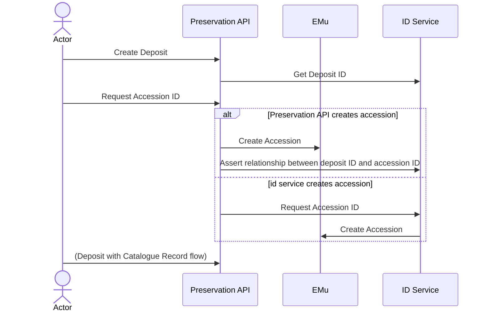

# Accession Workflow

Elsewhere we talk about the associate of digital objects and their _deposits_ with EMu catalogue records:

- [Deposit with Catalogue Record](calling-emu.md)
- [Export metadata to EMu](export-metadata.md)
- [Splitting Deposits, and multiple EMu records](splitting.md)

There is also the association of a deposit with an accession identifier, obtained from EMu. This is an identifier, still issued by EMu, for a set of files during appraisal - we don't yet know how they will be catalogued.

I might assign an accession ID – so there is the ID of the “job” - the deposit, and an accession ID, and later an EMu ID. And later still a Fedora URL, but that will be derived from something else – the path I put it plus its assigned id-minter ID.

The Preservation service should lean on the ID Service to manage all these relationships.

