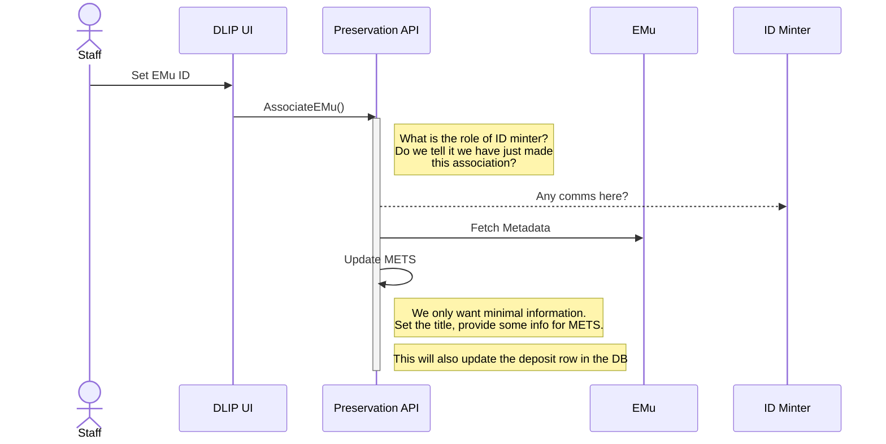

# Deposit with Catalogue Record

> If there is an EMu item for this thing, enter its ID. The app pulls in some details from EMu here to make it easier to identify this thing; “all relevant system IDs”. Can I do it the other way – create an EMu record for the whole object? Probably not. Maybe later.

Need to assign corresponding EMu id at start, or during, a process. You may know what it is at start, you may know later, it may never have an EMu id. 

This sequence occurs during the user interaction in [Create Deposit](create-deposit-with-notes.md).

