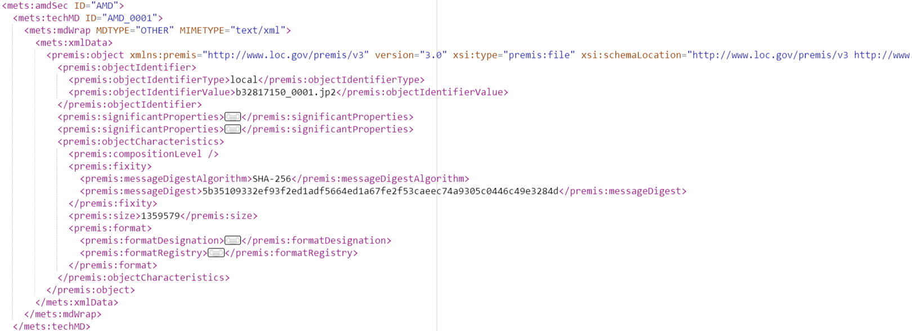

# Checksums

Our Storage API requires a Checksum (digest) be included as a property of every file mentioned in an import job.

The Preservation API will either create these, or pass through checksums supplied with content (in third party METS, or BagIt).

Different behaviours:

 - expect to find SHA256 digest in S3 object metadata in S3 Working 
 - expect to find in BagIt manifest file entries, will add to S3 metadata
 - expect to find in existing METS (e.g., Goobi provided)
 - supplied in client upload from browser, calculated on client, then set in S3 metadata
 - not supplied, want Preservation to calculate (rare, requires special dispensation!)

 Checksums are stored in the METS we generate in the same way they are stored in Goobi METS, in a `<premis:fixity>` element.

 We should ensure that Goobi does the same (the example below is a Goobi-generated METS file from Wellcome, so it definitely can do this).

 
 
 
 