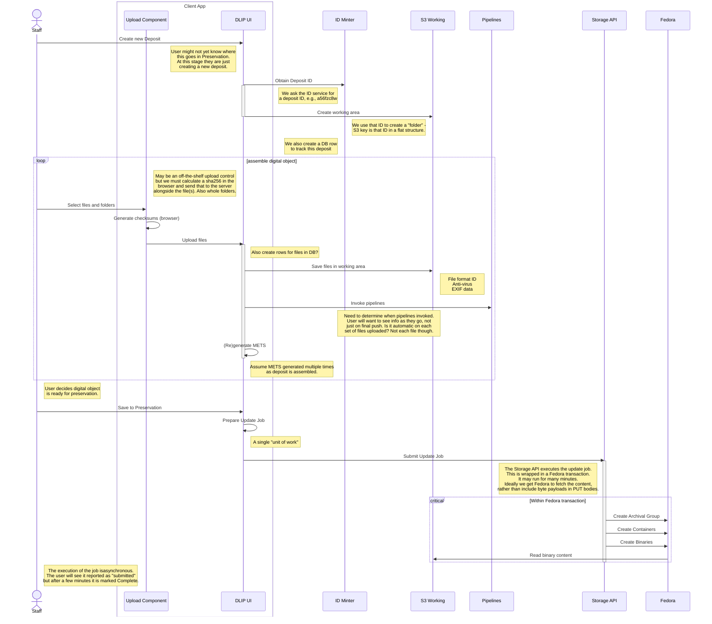

# Ad hoc deposit, no EMu - with notes

DLIP-UI is talking to an internal API separate from the storage API. This extra participant not shown in this view.

```mermaid
sequenceDiagram
    actor A as Staff
    box Client App
    participant UP as Upload Component
    participant UI as DLIP UI
    end
    participant ID as ID Minter
    participant S3 as S3 Working
    participant Pipe as Pipelines
    participant Storage as Storage API
    participant Fedora
    
    A->>UI: Create new Deposit
    Note left of UI: User might not yet know where<br>this goes in Preservation.<br>At this stage they are just<br>creating a new deposit.
    UI->>ID: Obtain Deposit ID
    activate UI
    Note left of ID: We ask the ID service for<br>a deposit ID, e.g., a56fzc8w
    UI->>S3: Create working area
    deactivate UI
    Note left of S3: We use that ID to create a "folder" -<br>S3 key is that ID in a flat structure.
    Note left of ID: We also create a DB row<br>to track this deposit
    loop assemble digital object
        Note right of UP: May be an off-the-shelf upload control<br>but we must calculate a sha256 in the<br>browser and send that to the server<br>alongside the file(s). Also whole folders. 
        A->>UP: Select files and folders
        UP->>UP: Generate checksums (browser)
        UP->>UI: Upload files
        activate UI
        Note right of UI: Also create rows for files in DB?
        UI->>S3: Save files in working area
        Note left of Pipe: File format ID<br>Anti-virus<br>EXIF data
        UI->>Pipe: Invoke pipelines
        Note over ID,S3: Need to determine when pipelines invoked.<br>User will want to see info as they go, not<br>just on final push. Is it automatic on each<br>set of files uploaded? Not each file though.
        UI->>UI: (Re)generate METS
        deactivate UI
        Note right of UI: Assume METS generated multiple times<br>as deposit is assembled.
    end
    Note right of A: User decides digital object<br>is ready for preservation.
    A->>UI: Save to Preservation
    UI->>UI: Prepare Update Job
    Note right of UI: A single "unit of work"
    UI->>Storage: Submit Update Job
    activate Storage
    Note left of Storage: The Storage API executes the update job.<br>This is wrapped in a Fedora transaction.<br>It may run for many minutes.<br>Ideally we get Fedora to fetch the content,<br>rather than include byte payloads in PUT bodies.
    critical Within Fedora transaction
        Storage->>Fedora: Create Archival Group
        Storage->>Fedora: Create Containers
        Storage->>Fedora: Create Binaries
        Fedora->>S3: Read binary content
    end
    deactivate Storage
    note right of A: The execution of the job isasynchronous.<br>The user will see it reported as "submitted"<br>but after a few minutes it is marked Complete.
```