# Ad hoc deposit, no EMu - with notes

[Deposit with Catalogue Record](calling-emu.md) shows how a call to EMu can be added to this flow.

DLIP-UI is talking to an internal API separate from the storage API. This extra participant not shown in this view, but is called _Preservation API_ in other sequence diagrams when it appears. The DLIP UI is a client of this API but so are other potential applications. The Preservation API is in turn a client of the Storage API. The Preservation API is home to concepts such a deposit, and the workflow around building up a deposit, and collaborating on it with others.

```mermaid
sequenceDiagram
    actor A as Staff
    box Client App
    participant UP as Upload Component
    participant UI as DLIP UI + Pres.API
    end
    participant ID as ID Minter
    participant S3 as S3 Working
    participant Pipe as Pipelines
    participant Storage as Storage API
    participant Fedora
    
    A->>UI: Create new Deposit
    activate UI
    Note left of UI: (1) User might not yet know<br>where this goes in Preservation.<br>At this stage they are just<br>creating a new deposit.
    UI->>ID: Obtain Deposit ID
    Note left of ID: (2) We ask the ID service for<br>a deposit ID, e.g., a56fzc8w
    UI->>S3: Create working area
    deactivate UI
    Note left of S3: (3) We use that ID to create a "folder"<br> - S3 key is that ID in a flat structure.
    Note left of ID: (4) We also create a DB<br>row to track this deposit
    loop assemble digital object
        Note right of UP: (5) May be an off-the-shelf upload control<br>but we must calculate a sha256 in the<br>browser and send that to the server<br>alongside the file(s). Also whole folders. 
        A->>UP: Select files and folders
        activate UP
        UP->>UP: Generate checksums (browser)
        UP->>UI: Upload files
        deactivate UP
        activate UI
        Note right of UI: (6) METS?<br>Also create rows for files in DB?
        UI->>S3: Save files in working area
        Note right of Pipe: (7) Pipelines:<br>File format ID<br>Anti-virus<br>EXIF data
        UI->>Pipe: Invoke pipelines
        Note over ID,S3: Need to determine when pipelines invoked.<br>User will want to see info as they go, not<br>just on final push. Is it automatic on each<br>set of files uploaded? Not each file though.
        UI->>UI: (Re)generate METS
        deactivate UI
        Note right of UI: Assume METS generated multiple times<br>as deposit is assembled.
    end
    Note right of A: (8) User decides digital object<br>is ready for preservation.
    A->>UI: Save to Preservation
    activate UI
    UI->>UI: (9) Prepare Import Job
    Note right of UI: A single "unit of work"
    UI->>Storage: Submit Import Job
    deactivate UI
    activate Storage
    Note left of Storage: The Storage API executes the Import Job.<br>This is wrapped in a Fedora transaction.<br>It may run for many minutes.<br>Ideally we get Fedora to fetch the content,<br>rather than include byte payloads in PUT bodies.
    critical Within Fedora transaction
        Storage->>Fedora: Create Archival Group
        Storage->>Fedora: Create Containers
        Storage->>Fedora: Create Binaries
        deactivate Storage
        Fedora->>S3: Read binary content
    end
    note right of A: The execution of the job is asynchronous.<br>The user will see it reported as "submitted"<br>but after a few minutes it is marked Complete.
```

## Notes

1. This user might be an external depositor. Or perhaps an external depositor has already been assigned a deposit to work in? The user might never explicitly choose the Fedora preservation path, it might be chosen for them based on workflow. Or it's not the job of the uploader of the files to decide where the object goes in the repository.
2. This identifier is for the job/deposit/working-set-of-files; it is not the EMu id nor is it necessarily the last path element of the eventual location of the Archival Group in Fedora. TBC - if you later export a digital object from Preservation, is it the same row? Is it the same deposit? No, it's a new row with a new ID. So this DB row represents the working set of files for a deposit. See [Pull from Repository](pull-from-repository.md)
3. Here we adopt a convention for file layout, with METS in the root and an `/objects` or `/contents` folder for the files. We have to allow for the possibility that the deposit already has a METS file that we didn't make.
4. See [deposits.sql](../schema/deposits.sql.md). There is no structure to our deposits, they are not arranged hierarchically UNLIKE their eventual homes in the repository. They are more like JOBS - you would find them by date, who owns them etc - not location. They are all in the same "place".
5. The loop in this diagram shows the assembly of a digital object. There is an implied API that user actions cause the DLIP UI to call. We don't know quite what that is yet - it's not the same as the Storage API - but it will be possible for other applications to call it, not just the web application DLIP UI. 
6. The **model** for the deposit is more than just the files and folders. This model can be represented in METS. But how is this METS model updated as the deposit is assembled? Do we want to have DB rows (see [files.sql](../schema/files.sql.md)), or is that unnecessary? Are there fields such as `notes` that are part of the deposit model as it is worked on but are not persisted to METS? Or do we use METS for everything? Are there things we would want in a files table in DB for querying on for reporting purposes, that would be difficult or inefficient to gather from METS files?
7. Invoke processing which will add further information to METS. How often is this run? Not on every file change/addition. Now we have pipelined updating the model, and user action (adding more files) updating the model, and that user action might trigger more pipeline invocation... so we need to work out how to orchestrate all this activity. Especially if the persistence for all this information is a METS file.
8. This user is probably staff.
9. See [ImportJob](https://github.com/digirati-co-uk/uol-leeds-experiments/blob/main/LeedsExperiment/Preservation/ImportJob.cs)