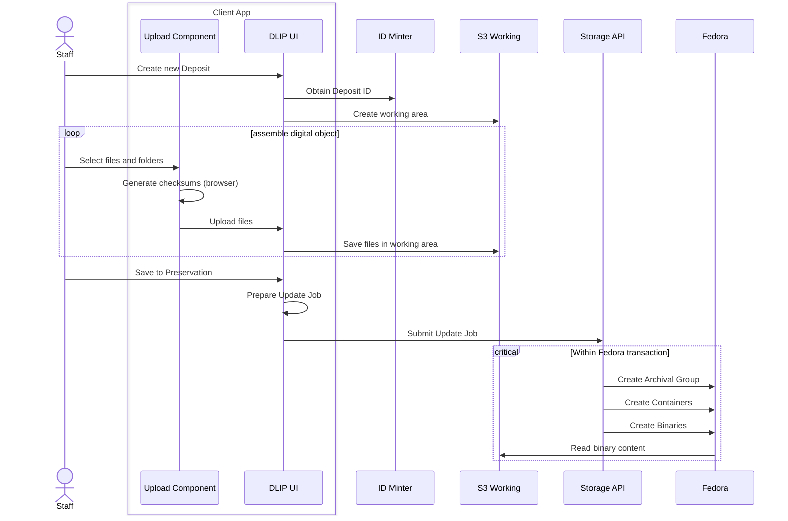

# Ad hoc deposit, no EMu

DLIP-UI is talking to an internal API separate from the storage API. This extra participant not shown in this view, but is called _Preservation API_ in other sequecne diagrams when it appears. The DLIP UI is a client of this API but so are other potential applications. The Preservation API is in turn a client of the Storage API. The preservation API is home to concepts such a deposit, and the workflow around building up a deposit, and collaborating on it with others.

The Upload Component is running in the user's browser to manage the bulk upload of files. It's part of the DLIP UI Web Application, aka Deposit Service. 

