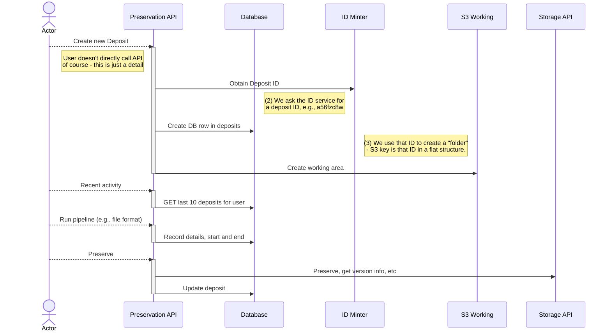

# Database and METS usage

One thing that characterises the Preservation API when compared to the Storage API is that it needs some kind of queryable persistence to manage the activity of deposits and use of Storage API. It needs to keep track of jobs. The Storage API, and Fedora behind it, are about Archival Groups. The Storage API doesn't care what's in the Archival Group, it has no meaning. The Presentation API does understand the content - as far as METS model, anyway. And it can manage the process of getting the content from users and external systems into the Storage API through the concept of a _deposit_.

[Deposits table](../schema/deposits.sql.md)

It's not clear whether we would also need a files table:

[Files table](../schema/files.sql.md)

And we probably need to record invocations of pipelines:

[Pipeline jobs table](../schema/pipeline_jobs.sql.md)

See Fedora-Usage-Principles.docx