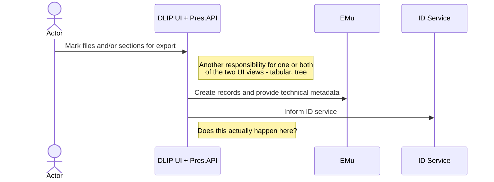

 # Export metadata to EMu

At any point, even long after it has been preserved, I can prepare a dataset to send to EMu that creates child records for sub sections – folders, even individual files (I choose what to do in the UI). I don’t have to do this in order for end users to see the structure, because the IIIF will carry that; I do this to assign identity in EMu below the original item level, and for reporting within EMu. It doesn’t have to be done for all items and doing it won’t necessarily change what the end user sees (other than they might see EMu identifiers on more things). 
 
Echoing this back to EMu is independent of assignment of rights in the file structure, although we will echo those assigned rights back to EMu.

