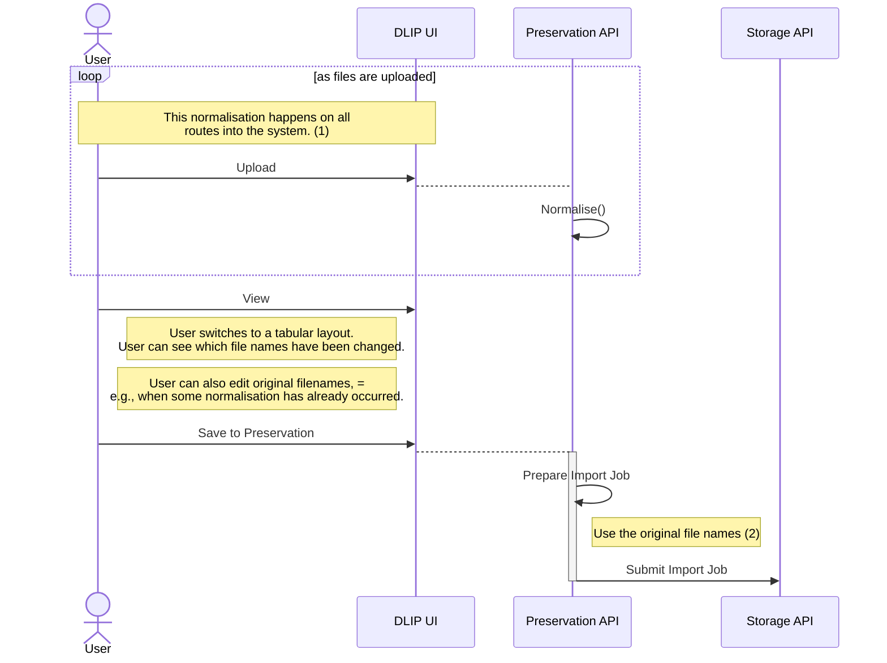

# File names and normalisation

Even files uploaded from a computer or collected from S3 may contain invalid paths.

The spreadsheet view shows original and normalised (highlight where different)

Also allows you to edit original names.

 - The UI presents a folder and file layout. You can see all the accumulated technical metadata that machines have extracted, but can’t edit it. You can edit access conditions and rights, hierarchically. Both of these are just strings from controlled vocabs (drop-downs). You can apply them at any level and override them below that. Do this in a METS-sensible way. The meanings of these strings is realised in asset delivery, but also (maybe) in who can see objects in the Preservation UI. A special case is opening up one object to one user (sharing progress of a deposit).

Files arriving from BitCurator via BagIt may contain original file names.

Original file names are stored as METS title attributes. This also applies to original FOLDER names which are 

This sequence occurs during the user interaction in [Create Deposit](create-deposit-with-notes.md).

## Notes

1. Our Preservation file-name-character set is more restrictive than most file systems, or S3. The Storage API only accepts normalised file names. Even on upload we may have to normalise. We preserve the original file name in METS title attributes. And _maybe_ in DB rows in [files](../schema/files.sql).
2. As the import job is constructed we use the [Name property](https://github.com/digirati-co-uk/uol-leeds-experiments/blob/main/LeedsExperiment/Fedora/Abstractions/Transfer/ResourceWithParentUri.cs#L31) of the BinaryFile and ContainerDirectory objects we supply. NB Currently BinaryFile also has FileName - but should that just use Name from the superclass?