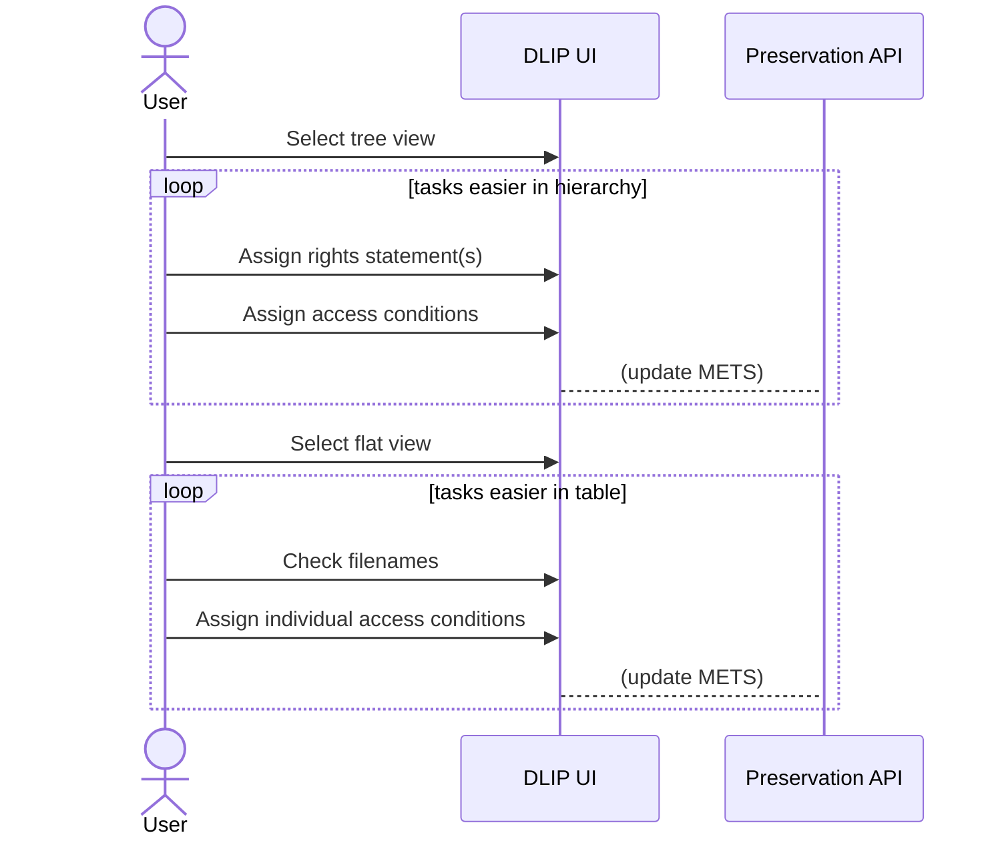

# Flat view and Directory view

## Tree view

A hierarchical, "explorer" view of files and folders (containers and binaries in Fedora terms) within the digital object (archival group).

This view is easier for inheriting, ACL-like access conditions - assign an access condition to a whole folder, for example.

## Flat view

Flat view is like a spreadsheet, easier to see normalised name vs folder name.

Allows sorting and filtering, e.g., on Access Condition.

You can assign rights statements and access conditions in either view.

