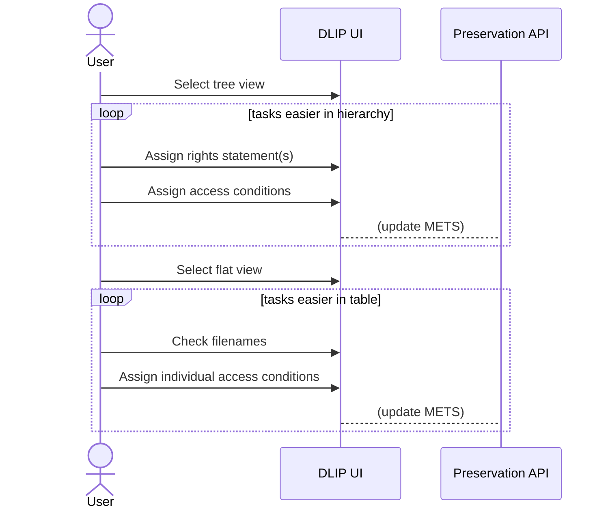

# Flat view and Directory view

Flat view is like a spreadsheet, easier to see normalised name vs folder name

Assign rights statements and access conditions

```mermaid
sequenceDiagram
    actor A as User
    participant UI as DLIP UI
    participant API as Preservation API

    A->>UI: Select tree view
    loop tasks easier in hierarchy
    A->>UI: Assign rights statement(s)
    A->>UI: Assign access conditions
    UI-->API: (update METS)
    end

    A->>UI: Select flat view
    loop tasks easier in table
    A->>UI: Check filenames
    A->>UI: Assign individual access conditions
    UI-->API: (update METS)
    end
```

