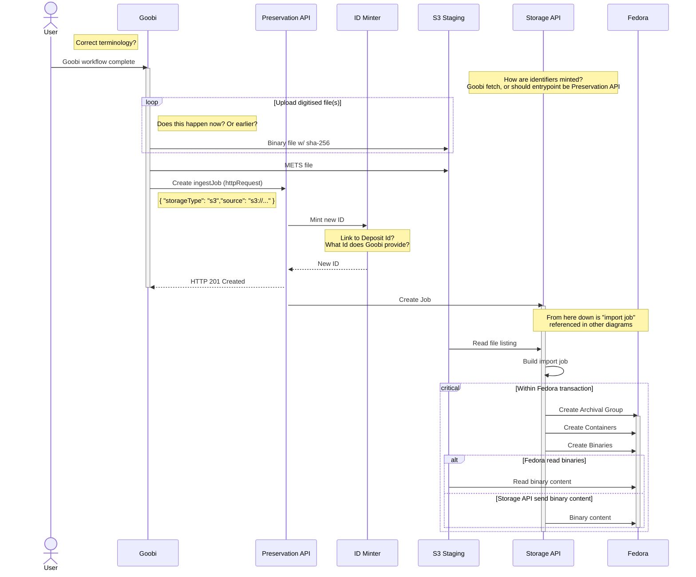
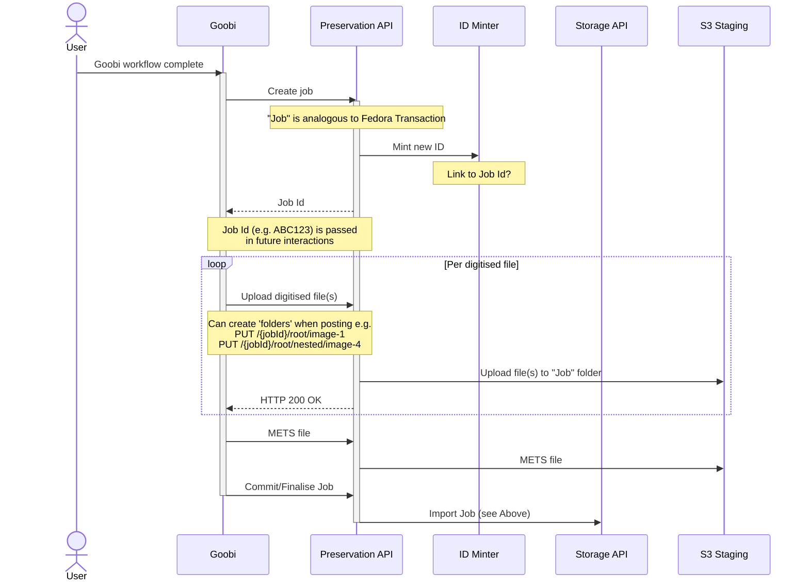

# Goobi API Interactions

## Summary

The below document outlines 3 possible interaction patterns for Goobi uploading data into Fedora.

1. _Goobi Uploads to S3_: Goobi will upload binaries to a staging S3 bucket directly (ie _not_ the bucket that Fedora will use). It then notifies the Storage API, which initiates the process of preserving data in Fedora.
2. _Goobi Upload to Preservation API_: Rather than uploading data to S3, Goobi will submit the binaries to the Preservation API. The Preservation API will then initiate the process for preserving data in Fedora (via the Storage API).
3. _Goobi Uploads to Fedora_: Goobi will directly interact with staging Fedora. Goobi notifies the Preservation API that workflow is complete and the Preservation API initiates importing data from _staging_ Fedora to _main_ Fedora (which is replicated etc).

Points to note:
* The entrypoint for Goobi may be incorrect as I'm unfamiliar with it's internal workings. I'm assuming a user manually interacts to start the ingest operation when they are 'done' (whatever that means). Uploads are being shown as happening when this 'done' action is initiated but in reality it might happen over time, files uploaded as saves made.
* "Fedora" is shown as single participant only, in reality this would be storing all assets in it's own S3 bucket which is then further replicated to alternative regions/Glacier etc.
* "Storage API" is the then HTTP wrapper around Fedora.
* "Preservation API" is higher level service that manages deposits, pipelines, calling Storage API

## Goobi Upload to S3

This diagram shows the sequence of operations for when Goobi is using an S3 bucket as backing store/staging area. The Storage API has read access to this S3 bucket. S3 is responsible for heavy lifting with uploads; can handle large uploads via `MultiPartUpload`, integrity checking etc.

When an ingest job is complete and ready to be ingested it calls the Storage API. The Storage API will construct a job to submit to Fedora. The exact mechanism of how this happens could differ (would need to test to see most appropriate mechanism):
* Fedora pulls from S3: Fedora is able to read content from an http endpoint. All content in S3 has an associated http URI, which can be used to read public content. However, this content will not be publicly accessible but the Storage API could generate a [presigned URL](https://docs.aws.amazon.com/AmazonS3/latest/userguide/using-presigned-url.html), which affords a time-limited access to an object, for Fedora to use.
* Storage API pushes to Fedora: the Storage API would make an HTTP PUT with binary content.

### Diagram

## Goobi Upload to Preservation API

This diagram shows the sequence of operations for when Goobi is calling the Preservation API, uploading the bytes of each asset directly. The Preservation API then stores the data in S3 staging area prior to importing to Fedora.

This is similar to [Create Deposit from external file set](create-deposit-from-s3.md) but Goobi can be seen as a trusted source - the Preservation API wouldn't need to create a METS file or run any pipelines, that has already been handled by Goobi.

When a ingest job is complete and ready to be ingested Goobi calls the Storage API to create a new Job and uploads file(s) associated with this job. Each file is stored into S3-Staging bucket. When all file(s) are uploaded the job is submitted. The Storage API will fetch the assets uploaded to S3 and forward them to Fedora, which will store them in it's own S3 bucket (which is then further replicated to alternative regions/cold storage etc).

Some notion of transaction management moved to Goobi but it is abstracted by the Preservation API.

### Diagram

## Goobi Uploads to Fedora

This diagram shows Goobi interacting directly with a staging Fedora instance. This has a separate S3 bucket, isolated from the main Fedora instance. Goobi can make as many versions of each item as it requires, it is free to use this Fedora instance as required. Upon completion of a workflow it will notify the Preservation API that it is complete and the Preservation API will manage moving it from staging Fedora to main Fedora.

This separation keeps the main Fedora 'clean' with regard to version history and ensures it only contains finished items and clean version history.

Goobi is responsible for transaction management with Fedora (keep-alive requests etc).

### Diagram

