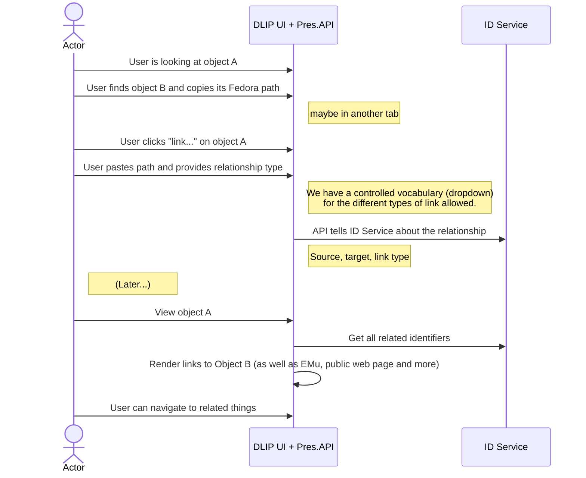

# Linking deposits

I can create a digital object without an EMu ID and link it to another object (which may or may not have an EMu ID) via an adjunct relationship.  “link digital files to catalogue records even if they are not the born-digital file”. 

This new object may also have come about by [splitting](splitting.md) another digital object.

It should be the responsibility of the Preservation API to tell the id service about the relationship, but not to manage the data for the relationship.

