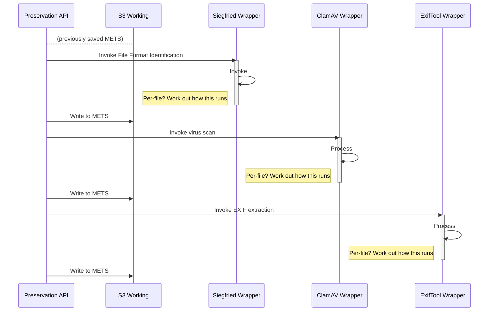

# Pipelines

We need to work out how these various tools are invoked.

The process relationships... whether they run as AWS Step functions, or plain lambdas, or as ECS services, or...

```mermaid
sequenceDiagram
    participant API as Preservation API
    participant S3 as S3 Working
    participant Siegfried as Siegfried Wrapper
    participant ClamAV as ClamAV Wrapper
    participant ExifTool as ExifTool Wrapper

    API-->S3: (previously saved METS)
    API->>Siegfried: Invoke File Format Identification
    activate Siegfried
    Siegfried->>Siegfried: Invoke 
    note left of Siegfried: Per-file? Work out how this runs
    deactivate Siegfried
    API->>S3: Write to METS
    API->>ClamAV: Invoke virus scan
    activate ClamAV
    ClamAV->>ClamAV: Process
    note left of ClamAV: Per-file? Work out how this runs
    deactivate ClamAV
    API->>S3: Write to METS
    API->>ExifTool: Invoke EXIF extraction
    activate ExifTool
    ExifTool->>ExifTool: Process
    note left of ExifTool: Per-file? Work out how this runs
    deactivate ExifTool
    API->>S3: Write to METS
```

