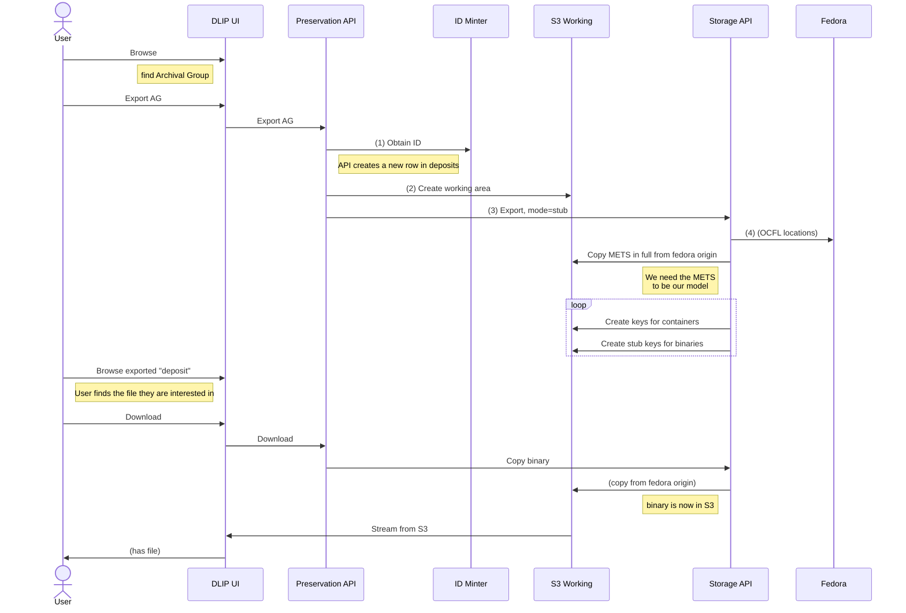

# Pull from repository (export)

Can this be drop-boxy - don't actually fetch all the files, just make stub keys in S3 from the METS file AND correlate to the Fedora OCFL object

... need to be VERY careful!

Must never write a stub back by mistake.

We only fetch the actual binary from S3 if you want to see it. (what happens then - how do you "see" it? - download? download streams from S3 origin in OCFL)

This is the default - mode=stub - see note 3 below. But I might want to export the full object, all the binaries intact, for some other purpose, so I can optionally use mode=full.

-	At any point, even long after it is preserved, I can pull an object out of preservation and update granular permissions. Typically this only changes a METS file. (impl – are we resuscitating DB rows to do this so we can re-make a METS file?)

