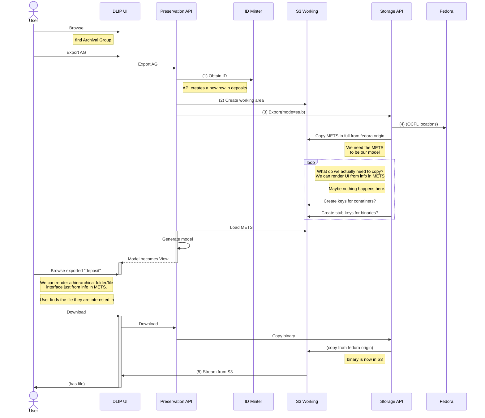

# Pull from repository (export)

Can this be drop-boxy - don't actually fetch all the files, just make stub keys in S3 from the METS file AND correlate to the Fedora OCFL object.

... need to be VERY careful!

Must never write a stub back by mistake. The Storage APi work so far is focussed on comparing a layout of files in S3 with the repository's view - generating a diff. But we don't need to bring the files into S3 to generate a UI.

We only fetch the actual binary from S3 if you want to see it. (what happens then - how do you "see" it? - download? download streams from S3 origin in OCFL)

This is the default - `mode=stub` - see note 3 below. But I might want to export the full object, all the binaries intact, for some other purpose, so I can optionally use mode=full.

-	At any point, even long after it is preserved, I can pull an object out of preservation and update granular permissions. Typically this only changes a METS file. (impl – are we resuscitating DB rows to do this so we can re-make a METS file?)

## Notes

1. We need to identify this "working object" - we don't pull it out into the same S3 location as when it was ingested. Each time it's exported it goes somewhere unique. (discuss). We create a new row in [deposits](../schema/deposits.sql).
2. (see above) S3 location which is only used for this one working object - there _might_ be the same objected exported elsewhere for some other reason.
3. `export(mode=stub)` We might not need to export anything other than the METS file. It depends what we're exporting for. If we want to do things with binary content we need the files in working S3, rather than in Fedora, but if we're just editing an access condition we don't need to fill up S3.
4. The Storage API use the OCFL layout to give us the origin, so we can do a copy.
5. Even here - could we not just provide a stream _straight from Fedora S3_? We do something very similar in Wellcome storage.

Having a "working set" of files is obviously necessary when creating a deposit in the first place. And it may be necessary for some kinds of work performed on them. And a working set might consist of additions (they have to be uploaded somewhere before synching with Fedora). But most browsing around a digital object just needs:

 - a view driven by a METS-derived model
 - the ability to _see_ files - view images, play video, read docs.

The latter will often (but not always) be provided by the IIIF-C environment - but to what extent does the Preservation view know about that? Is it even aware of Manifests? Is that a different responsibility? We don't want to tightly couple purely presentation concerns to asset delivery, but we also want to make it easy for staff browsers-of-the-repository to see the content itself not just the directory structure and file names.
