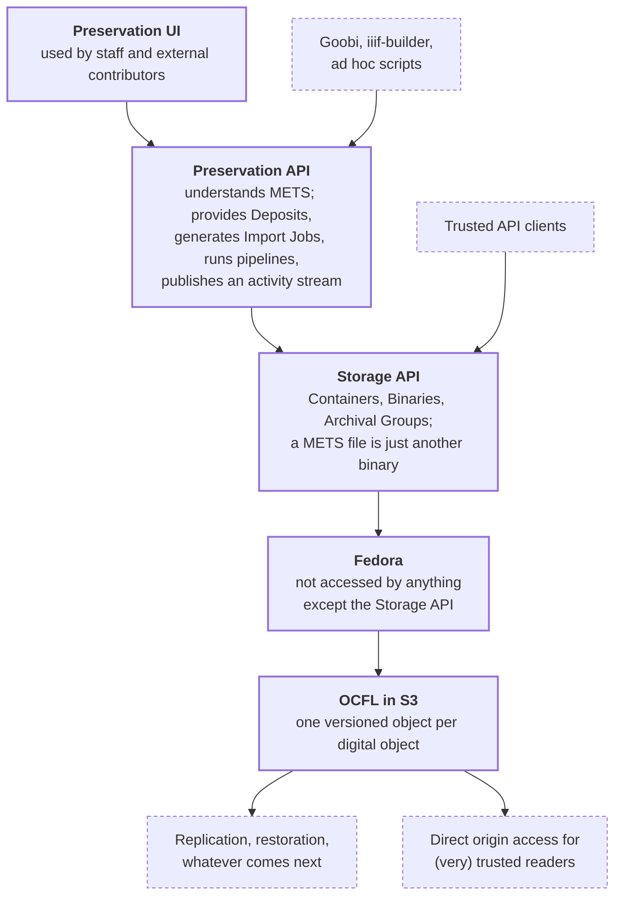

import { Image } from 'astro:assets';
import { Aside, LinkCard, CardGrid } from '@astrojs/starlight/components';
import ocflLogo from '../../../assets/ocfl-hand-drive.png';

The Digital Preservation platform takes sets of files - a digitised book, a manuscript, a born-digital
collection - and stores them as **versioned digital objects**, in the
[Oxford Common File Layout](https://ocfl.io/1.1/spec/) (OCFL). The platform exists to
produce those OCFL objects and to make them easy to build, update and read.

This documentation explains how to use the platform. It is written for:

- **Developers writing API clients.** Most integrations - Goobi, the iiif-builder, migration scripts,
  ad hoc tools - talk to the [Preservation API](../../preservation-api/overview). This forms the bulk
  of the documentation, and is accompanied by runnable Python samples.
- **People using the Preservation UI.** The [UI section](../../ui/overview) covers browsing the
  repository, creating deposits, uploading files and running pipelines through the web interface.
- **Operators and contributors** who need to know how the pieces fit together. The
  [Storage API](../../storage-api/overview) and [Internals](https://github.com/digirati-co-uk/digital-preservation/blob/main/docs/internals/overview.md) sections describe
  the layers underneath the Preservation API.

## The preservation stack

Reading the diagram from the bottom up:

| Layer | What it is |
| --- | --- |
| **OCFL in S3** | The preserved content itself: one OCFL object per digital object (Archival Group), each with a full version history. |
| **Fedora** | The repository software that writes and versions the OCFL objects. Nothing talks to Fedora except the Storage API. |
| **Storage API** | The gateway to Fedora. Knows about Containers, Binaries and Archival Groups, and turns Import Jobs into new OCFL versions. Does not know what a METS file is. |
| **Preservation API** | The application-facing API. Understands METS, provides Deposits (working areas in S3) for assembling content, generates Import Jobs, runs tools over files, and publishes an activity stream. |
| **Preservation UI**, Goobi, iiif-builder, scripts | Clients of the Preservation API. |

The [Components](../components) page describes each of these in more detail, and the
[Concepts](../concepts) page defines the terms used throughout the site.

## Recoverable from OCFL alone

<figure style="margin: 0 0 1.5rem 0; width: 200px;">
  <Image src={ocflLogo} alt="The OCFL logo: a hand holding a hard drive aloft" width="200" />
  <figcaption style="font-size: var(--sl-text-xs); color: var(--sl-color-gray-3); margin-top: 0.5rem;">
    <a href="https://ocfl.io/">OCFL</a> logo: "hand-drive" by <a href="https://orcid.org/0000-0001-8390-6171">Patrick Hochstenbach</a>,
    licensed under <a href="https://creativecommons.org/licenses/by/2.0/">CC BY 2.0</a>.
  </figcaption>
</figure>

A design principle of the platform is that the running systems are not needed for the preserved content
to be usable. Given a copy of the S3 bucket (or a hard drive containing the same file layout) and the
OCFL specification, everything that was preserved can be recovered: every version of every file, with
its checksum, and the METS file that describes how the files fit together. The databases behind Fedora, the
Preservation API and the Storage API hold working state and history, but nothing that the OCFL objects do not
also record.

## Where to start

<CardGrid>
  <LinkCard title="Concepts" href="../concepts" description="Archival Groups, Containers, Binaries, Deposits, METS, Import Jobs and versions - the vocabulary and model." />
  <LinkCard title="Preservation API" href="../../preservation-api/overview" description="Hosts, JSON conventions, authentication, and the endpoints." />
  <LinkCard title="Workflows" href="../../workflows/overview" description="End-to-end walk-throughs: preserve something for the first time, update it, export it." />
  <LinkCard title="Preservation UI" href="../../ui/overview" description="The web interface for staff and contributors." />
</CardGrid>
